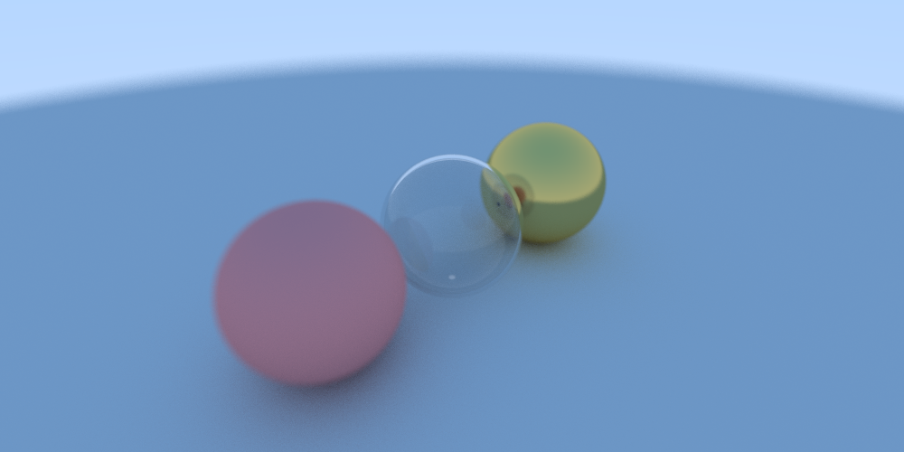

# Rusty Raytracer

Nothing too fancy here, just a simple ray tracer made based on Peter Shirley's excellent book, [Ray Tracing In One Weekend](https://www.amazon.co.uk/Ray-Tracing-Weekend-Minibooks-Book-ebook/dp/B01B5AODD8)

I wanted to learn Rust, and so decided this would be an ideal first rust project. I'd like to continue adding to it and learning both rust and ray tracing.

Here's how it currently looks, complete with diffuse, metallic and dialectric materials. You can position and configure the camera, which supports depth of field. You can made more spheres if you like. Not really that much, but I'm proud of it.

